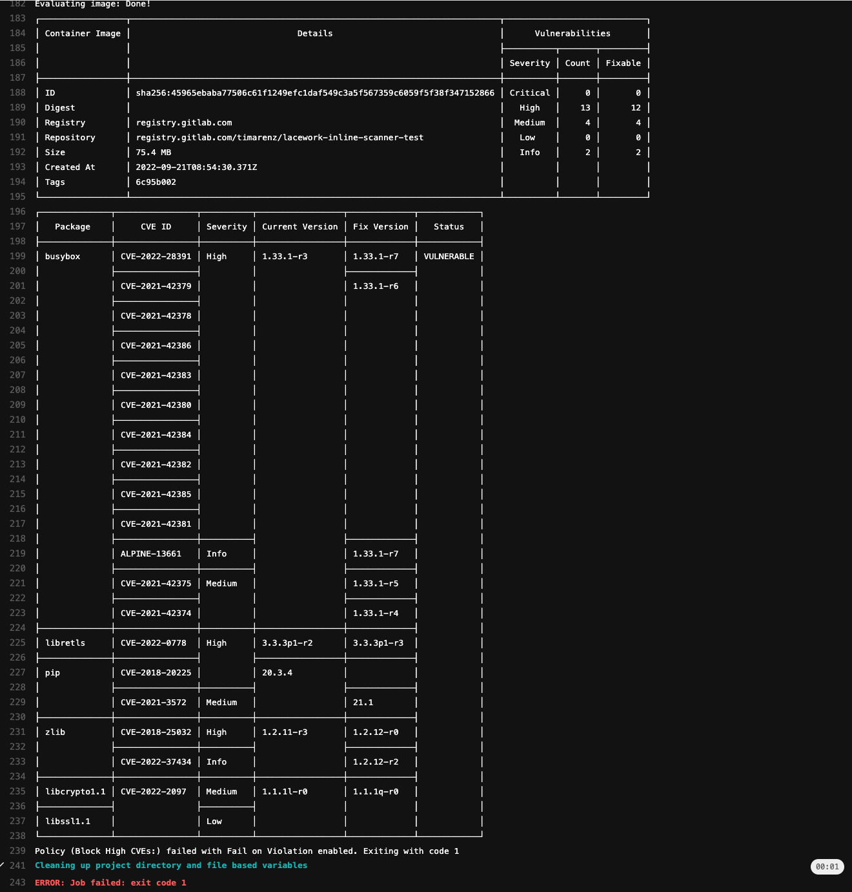

# gitlab

This repo contains example how to integrate the Lacework inline scanner with GitLab CI/CD.

Easiest way to integrate with GitLab CI/CD is to use the Lacework [Inline Scanner Docker image](https://docs.lacework.com/onboarding/integrate-the-lacework-inline-scanner-with-ci-pipelines#docker-image-for-inline-scanner).

The example below shows a stage and script called `lacework-inline-scanner` that uses the latest docker image and runs the inline scanner as docker container itself.

In order to use the inline scanner two [CI/CD variables](https://docs.gitlab.com/ee/ci/variables/) need to be set and passed to the container: `LW_ACCOUNT_NAME` and `LW_ACCESS_TOKEN`. See [official documentation](https://docs.lacework.com/onboarding/integrate-inline-scanner#configure-auth) regarding the values.

In this example the output of the inline scanner is formatted to be easily readable within the logs (`--pretty --simple --no-color`), the result is uploaded to the Lacework platform (`--save`) using some build information (`--build-id "$CI_COMMIT_SHORT_SHA" --build-plan "$CI_PROJECT_NAME"`) to be able to search for commit sha or the project name. Last but not least the error code of the inline scanner will be `1` if a central Lacework policy is configured to block (`--policy --fail-on-violation-exit-code 1`), for example, when a high CVE is found.

More details around the used flags can be founde here: <https://docs.lacework.com/onboarding/integrate-inline-scanner#flags-for-image-evaluate>

```yaml
stages:
  - lacework-inline-scanner

lacework-inline-scanner:
  image: docker:latest
  stage: lacework-inline-scanner
  services:
    - docker:dind
  script:
    - |
      docker run \
      -e LW_ACCOUNT_NAME \
      -e LW_ACCESS_TOKEN \
      -v /var/run/docker.sock:/var/run/docker.sock \
      lacework/lacework-inline-scanner:latest \
      image evaluate "$CI_REGISTRY_IMAGE" "$CI_COMMIT_SHORT_SHA" \
      --build-id "$CI_COMMIT_SHORT_SHA" --build-plan "$CI_PROJECT_NAME" \
      --pretty --simple --no-color \
      --policy --fail-on-violation-exit-code 1 \
      --save
```

Example file: [.gitlab-ci.yml](.gitlab-ci.yml)

Example of a failed/blocked job.


