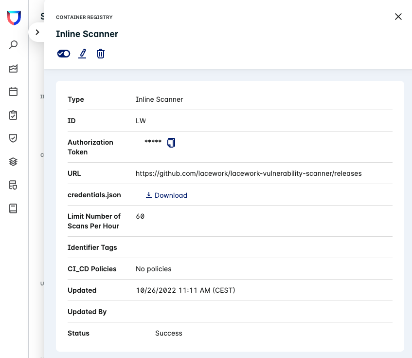
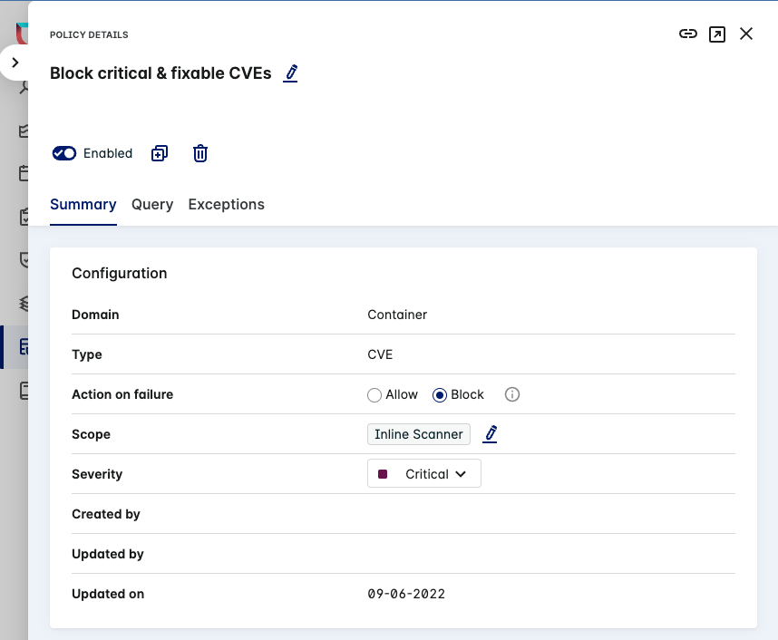
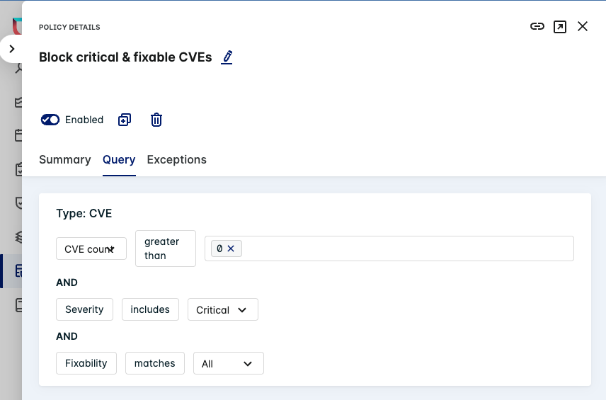
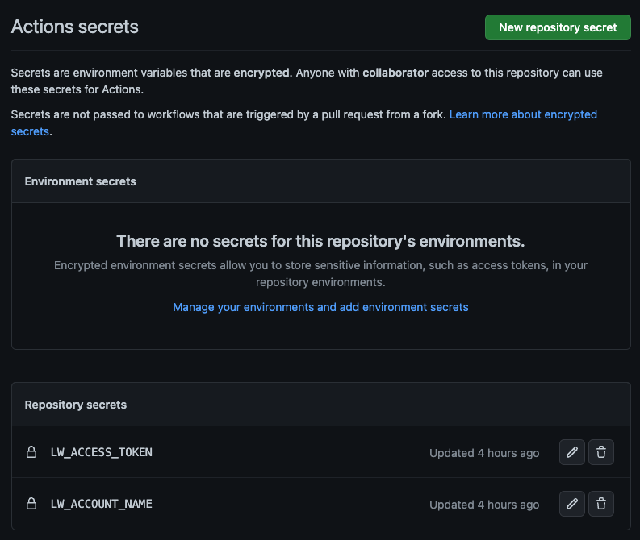

# inline-scanner

The Lacework Inline Scanner (lw-scanner) is a binary that can virtually run anywhere and allows on-demand vulnerability scanning of container images.
This folder describes integration examples with different CI/CD tools like GitHub Actions.

## Prerequistis

In order to set up an integration with the Inline Scanner and Lacework an integration needs to be created. Also, if you want to fail a CI/CD pipelines, for example, if a critical and fixable vulnerability is found, you need to create and attach a policy.

### Inline Scanner Integration in Lacework

In order for the scanner to be able to scan images and upload results to the Lacework platform an integration needs to be setup.
Please follow the offical documentation to do the integration: <https://docs.lacework.com/onboarding/integrate-inline-scanner#create-an-inline-scanner-integration-in-lacework>

After the integration is created make sure to copy the authorization token, which is required for authentication of the lw-scanner later.

Also make sure to note your Lacework accout name. This is the URL to access the Lacework console excluding the `.lacework.net`, for example for the URL `youraccount.fra.lacework.net` the account name is `youraccount.fra`.



### Lacework Policy to fail/block CI/CD pipelines

You can configure lw-scanen to fail/block CI/CD pipelines if certain criterias are met.

Examples:

- Critical or high vulnerabilities are found
- Fixable vulnerbilites are found

In this case the lw-scanner can be configure to exit with an exit code other than 0.

For this, a policy needs to be created in Lacework and attached to the Inline Scanner Integration.

First, create the policy by following official documentation: <https://docs.lacework.com/console/container-vulnerability-policies> and attach it to the existing Inline Scanner integration that was created before. Also, make sure the policy is enabled and "Action to failure" is set to "Block".



Second, make sure the policy query is set up as per your requirements. In our example it is set to block if a critical and fixable CVE is found.



## Integrations with CI/CD pipelines

Below a different example on how to integrate Lacework Inline scanner with different CI/CD pipeline tools like GitHub actions.
For the latest information, always have a look at the official documentation: <https://docs.lacework.com/onboarding/integrate-the-lacework-inline-scanner-with-ci-pipelines>

### GitHub Actions

For GitHub Actions Lacework provides a prebuilt action available in the GitHub marketplace: <https://github.com/marketplace/actions/lw-scanner>

In order to use the action the access token used by the previously created Inline Scanner Integration needs to be set as GitHub Actions repository secret. By default in this example the secret name `LW_ACCESS_TOKEN` is used. In addition, the `LW_ACCOUNT_NAME` secret can be created to mask the name of your Lacework account. This is recommended if lw-scanner is used in a public repository. If the `LW_ACCOUNT_NAME` make sure to set it to your Lacework account name a discussed previously.



After the secret is set you can add/modify your existing workflow and add the lw-scanner action or create a new example.

```yaml
name: vulnerability-scan
on: [push, workflow_dispatch]

jobs:
  vulnerability-scan:
    runs-on: ubuntu-latest

    steps:
      - uses: lacework/lw-scanner-action@v1.2.0
        name: Scan container image for vulnerabitilies using Lacework
        with:
          LW_ACCOUNT_NAME: ${{ secrets.LW_ACCOUNT_NAME }}
          LW_ACCESS_TOKEN: ${{ secrets.LW_ACCESS_TOKEN }}
          IMAGE_NAME: techallylw/vulnerable-container
          IMAGE_TAG: v0.0.1
          SAVE_RESULTS_IN_LACEWORK: true
```

Example file: [vulnerability-scan.yaml](vulnerability-scan.yaml)

More complete example file: [build-and-scan.yaml](build-and-scan.yaml)

It is important to notice that the lw-scanner-action uses policies by default. If any policy is attached to the Inline Scanner Integration it will be atomatically used by the GitHub Action. If the policy is set to `Block` the step fill fail with an exit code of `1` (see example screenshots [1](gha-scan-result-1.png) and [2](gha-scan-result-2.png)).
